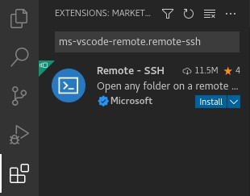
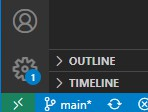
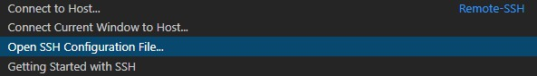
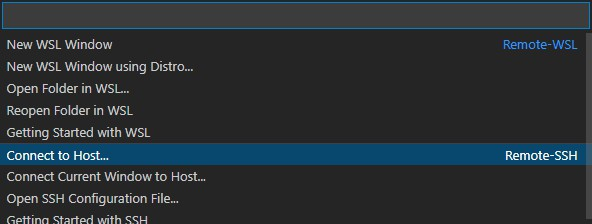
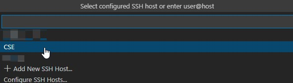
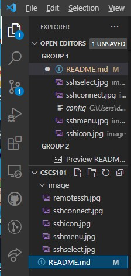
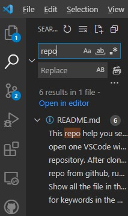
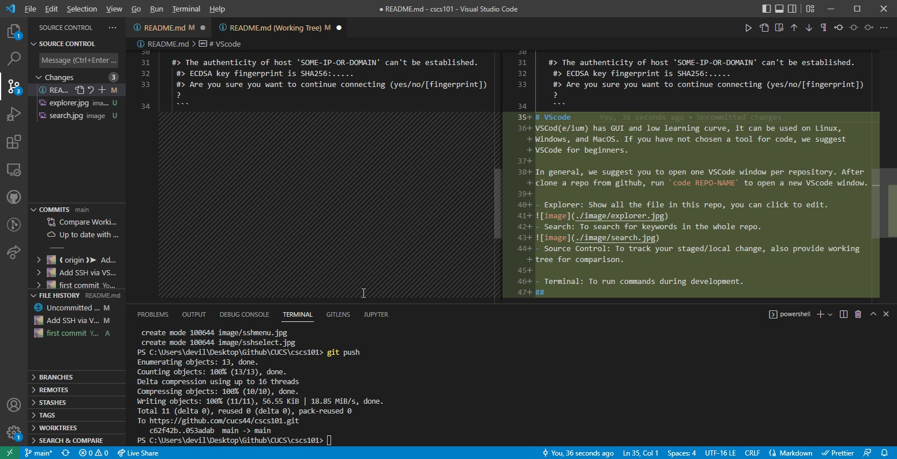
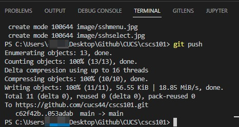

# Before you start
This repo help you setup the environment.  
We suggest using UNIX system to devleop, if you are using window, you may try WSL/VM/CSE server
# Using SSH to connect linux server
In this session, we are connect to cse linux server via vscode. It would take up around 400MB on your allocated space on linux server. If you want to save the space, use terminal instead. Also you may want to enable   `[remote.ssh: remote server listen on socket]` for your remote:ssh plugin before connect.
1. Connect to CUHK CSE network  
   Follow [this guide](https://www.cse.cuhk.edu.hk/misc/cse-account-password-vpn/) from CSE department to use VPN
2. Install remote-ssh plugin  
   search `ms-vscode-remote.remote-ssh`, press `install`  
     
3. Create an alias for ssh login configuration  
   - Click the ssh icon at bottom-left corner  
     
   - Then select `Open SSH Configuration File`  
     
   - Select a ssh config file(recommend select the one including your username in path)
   - Edit the config    
    ```
    Host CSE
        HostName linux7.cse.cuhk.edu.hk
        User YOUR-UNIXID
    ```
    Note: HostName can be from linux1 to linux16. Also, if you don't want to connect to CSE network, you can set the HostName as `gw.cse.cuhk.edu.hk`
4. Connect to remote  
   - Click the ssh icon at bottom-left again and select `Connect to Host...`   
     
   - Select the alias you just config  
     
   - Enter your unix password  
    Note: You may need to choose yes for first time connecting to the server.
    ```
    > The authenticity of host 'SOME-IP-OR-DOMAIN' can't be established.
    > ECDSA key fingerprint is SHA256:.....
    > Are you sure you want to continue connecting (yes/no/[fingerprint])? 
    ```
# Github SSH
We suggest you setup SSH for github and use ssh for github operation  [Docs](https://docs.github.com/en/authentication/connecting-to-github-with-ssh)  
   1. In terminal, run `ls -al ~/.ssh`. (`Get-ChildItem ~/.ssh` if you are using windows shell)
   2. Check if one of following exist
      - id_rsa.pub       
      - id_ecdas.pub
      - id_ed25519
   3. If not, run `ssh-keygen -t rsa -C "YOUR_GITHUB_EMAIL@example.com"`  
      This create new SSH key with email as label. The output should be like: 
      
      ``` 
      > Generating public/pravate rsa key pair.  
      > Enter a file in which to save the key (/c/Users/username/.ssh/id_rsa): [Press enter] 
      > Enter passphrase (empty for no passphrase):  
      > Enter same passphrase again:  
      ```
      For the passphrase, you can either just leave it blank or type your secret passphrase for higher security. See the above Docs for more detail.
   4. Run `cat ~/.ssh/id_rsa.pub` (`Get-Content ~/.ssh/id_rsa.pub` if you are using windows shell)  
      - Replace `rsa` to `ecdas` or `ed25516` if already exist in your .ssh folder
      - Make sure you include the the .pub in filename.  
      #### The result should be
      ``` 
      ssh-rsa SomeRandomLongStringEndWith= YOUR_GITHUB_EMAIL@example.com
      ```
   5. Copy that string 
   6. Go to Github > Settings > Access > SSH and GPG keys 
   7. Press the green button `New SSH key` on the top-right corner
   8. Fill the Title for you to reconginze and Paste the id_rsa.pub in Key
   9. Click `Add SSH key`  
  
You can try to clone this repo via `git clone git@github.com:cucs44/cscs101.git` to see whether set-up correct.  
  
# VScode
VSCod(e/ium) has GUI and low learning curve, it can be used on Linux, Windows, and MacOS. If you have not chosen a tool for code, we suggest VSCode for beginners.  

In general, we suggest you to open one VSCode window per repository. After clone a repo from github, run `code REPO-NAME` to open a new VScode window.
## Feature
- Explorer: Show all the file in this repo, you can click to edit.  
Note: You can drag a file into explorer to upload that to your remote server. Right click a file and select download can do the reverse.  
  
- Search: To search for keywords in the whole repo.  
  
- Source Control: To track your staged/local change, also provide working tree for comparison.  
  
- Terminal: To run commands during development.  
  

## Configs
You may want to set these config  
`"terminal.integrated.scrollback": 100000`: increase your scrollback buffer large enough to see some error message, default of 1000 is grossly not enough.  

`"editor.formatOnSave": true`: formate your code on save, this feature will call the formatter of your own choice, you have to install some formatter for it work properly.  

`"diffEditor.ignoreTrimWhitespace": false`: some programming language(like Python) care about whitespace.

## Extension
### General

`ms-vscode-remote.remote-ssh`: Use VSCode on remote directory just like local  

`aaron-bond.better-comments`: Highlight comments by categories  

`eamodio.gitlens`: Integrate GUI git diff and history, among other features, into VSCode

### Language Specific

`ms-python.vscode-pylance`: python3 syntax highlighter and linter support

`esbenp.prettier-vscode`: javascript formatter

`graphql.vscode-graphql`: graphql syntax highlighter

## Hotkeys [(ref)](https://code.visualstudio.com/shortcuts/keyboard-shortcuts-linux.pdf)

### General
`ctrl + -`: Decrease text size

`ctrl + =`: Increase text size

### Editing

`ctrl+f`: find, you can also do highlight then ctrl+f (or other find / replace hotkey), VSCode generate the required Regex for you.

`ctrl+shift+F`: find globally

`ctrl+h`: replace

`ctrl+shift+H`: replace globally

`ctrl+g`: go to line (enter a line number)

`ctrl+shift+arrow`: multi-line text cursor

`ctrl+alt+shift+↓ / ↑`: select multiple line

`ctrl+/`: comment / uncomment

`ctrl+w`: close file

`ctrl+shift+I`: format file

`alt+shift+↓ / ↑`: copy current line and insert below/above

`alt+↓ / ↑`: move line down/up

`ctrl+k``ctrl+0`: fold/unfold all region

### Terminal

`` ctrl+` ``: open / close terminal, focus to terminal

`ctrl+shift+5`: split terminal into 2

``ctrl+shift+` ``: new terminal

`ctrl+d`: terminate current terminal
